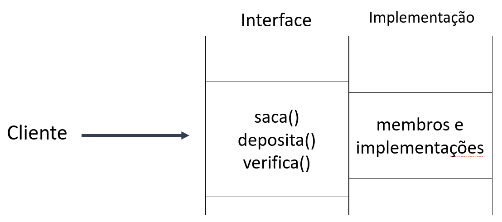

# Interface

Ao se tratar de **Encapsulamento de dados**, têm-se como objetivo esconder o acesso aos membros de uma classe, e a implementação de seus métodos.

**Interface** é o conjunto de métodos públicos que **descreve um determinado comportamento**.

A interface possui especificações para outras classes. Qualquer classe que implemente um método deve, **necessariamente**, implementar os métodos especificados.